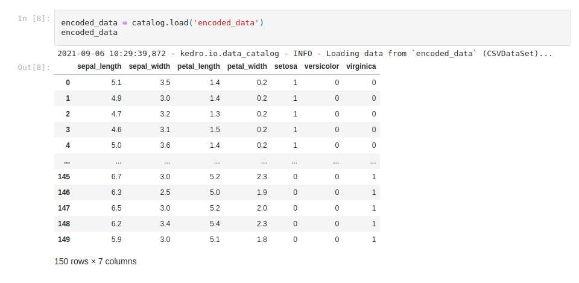
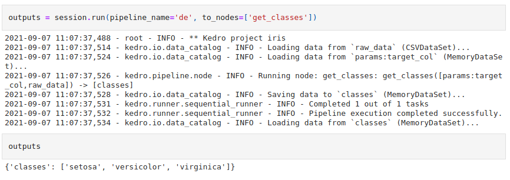

[](https://github.com/khuyentran1401/kedro_demo) 
## Create Maintainable and Modular Data Science Pipelines with Kedro

### Motivation

Have you ever passed your data to a list of functions and classes without knowing for sure how the output is like?


You might try to save the data then check it in your Jupyter Notebook to make sure the output is as you expected. This approach works, but it is cumbersome.

```python
def process_data(data):
  pass

def split_data(data):
  pass 

df = process_data(data)
df.to_csv('processed_data.csv')

X_train, X_test, y_train, y_test = split_data(data)
```

Another common issue is that it’s hard to understand the relationships between functions when looking at a Python script that contains both the code to create and execute functions.
```python

def split(data):
  pass 

def train(X_train, y_train):
  pass

def predict(X_test, model):
  pass 

def report(predictions):
  pass

X_train, y_train, X_test = split(data)
model = train(X_train, y_train)
predictions = predict(X_test, model)
report(predictions)
```
Your code looks even more complex and hard to follow as the project grows.

Wouldn’t it be nicer if you can visualize how the inputs and outputs of different functions are connected like below?


That is when Kedro comes in handy.

### What is Kedro?


[Kedro](https://kedro.readthedocs.io/en/stable/index.html) is an open-source Python framework for creating reproducible, maintainable, and modular data science code. It borrows concepts from software engineering best-practice and applies them to machine learning code.

Kedro allows you to:

1.  Create a data science from a cookie-cutter template
2.  Create a data science pipeline
3.  Slice a pipeline
4.  Modularize a pipeline
5.  Configure your data and parameters through a YAML file
6.  Effortlessly analyze nodes’ outputs in a Jupyter Notebook
7.  Visualize your pipeline
8.  Create documentation for your project

To install Kedro, type:

```bash
pip install kedro
```
### Set Up a Data Science Project

#### Create a Data Science from a Cookie-Cutter Template

Have you ever contemplated how to structure your data science project so that it is logical and reasonably standardized? Wouldn’t it be nice if you can create a well-defined and standard project structure in one line of code?

That could be easily done with Kedro. After installing Kedro, you can create a new empty project using:

```bash
$ kedro new
```

After going through a series of questions, a new project will be created with the structure like below:


If we look at the project structure at a higher level, we can see that there are 5 main directories:


-   `conf`: Store configuration files
-   `data`: Store data
-   `docs`: Store documentation of the project
-   `logs`: Store log files
-   `notebooks`: Store Jupyter Notebooks
-   `src`: Store the main code

#### Install Dependencies

Kedro requires some basic dependencies before using. These dependencies are specified under `src/requirements.txt` . To install these dependencies, type:

```bash
$ kedro install
```

And all necessary dependencies to run the pipelines will be installed in your environment.

Now that we learn how to set up a data science project, let’s understand how to create a pipeline with Kedro.

#### Create a pipeline

To create a new pipeline, type:

```bash
$ kedro pipeline create <NAME>
```

Since there are often 2 steps in a data science project: data processing and model training, we will create a pipeline called `data_engineer` and a pipeline called `data_science` :

```bash
$ kedro pipeline create data_engineering  
$ kedro pipeline create data_science
```

These two pipeline directories will be created under `src/project_name` :


Each pipeline consists of 4 files:

-   `__init__.py`
-   `README.md` : specifies information about the pipeline
-   `node.py` : contains nodes
-   `pipeline.py` : contains pipelines

#### Node

A pipeline consists of multiple nodes. Each node is a Python function.

```python
from typing import Any, Dict, List
import pandas as pd

def get_classes(data: pd.DataFrame, target_col: str) -> List[str]:
    """Node for getting the classes from the Iris data set."""
    return sorted(data[target_col].unique())
```

For each node, there are input(s) and output(s):
```python
from .nodes import get_classes
from kedro.pipeline import Pipeline, node

pipeline = Pipeline(
        [
            node(
                get_classes,
                inputs=["raw_data", "params:target_col"],
                ouputs="classes",
                name='get_classes',
            ),
        ]
```

Visualization of the node `get_classes`:


Inputs and outputs of each node can be specified using `None` , string, a list of strings, or a dictionary. Note that these strings are **abstract names, not the real values**.

Why are names useful? If we know the name of each function’s inputs and outputs, we can easily grab a specific input or output by calling its name. Thus, there is **less ambiguity** in your code.


You can find all node definition syntax [here](https://kedro.readthedocs.io/en/stable/06_nodes_and_pipelines/01_nodes.html#node-definition-syntax).

### Pipeline

A pipeline consists of a list of nodes. It connects the outputs of one node to the inputs of another node.

For example, in the code below, `'classes'` (output of the function `get_classes` ) and `'encoded_data'` (output of the function `encode_categorical_columns`) are used as the inputs of the function `split_data` .

```python
from kedro.pipeline import Pipeline, node
from .nodes import get_classes, encode_categorical_columns, split_data


def create_pipeline(**kwargs):
    return Pipeline(
        [
            node(
                get_classes,
                ["raw_data", "params:target_col"],
                "classes",
                name='get_classes',
            ),
            node(
                encode_categorical_columns,
                ['raw_data', 'params:target_col'],
                'encoded_data',
                name='encode_categorical_columns',
            ),
            node(
                split_data,
                ["encoded_data", "params:test_data_ratio", "classes"],
                dict(
                    train_x="train_x",
                    train_y="train_y",
                    test_x="test_x",
                    test_y="test_y",
                ),
                name="split",
            )
        ]
    )
```

The Data Catalog is located under `conf/base/catalog.yml` .

Visualization of the pipeline above:


### Register and Run the Pipeline

Now that we have the node and the pipeline, let’s register these pipelines in the file `src/project_name/pipeline_registry.py` :

```python
"""Project pipelines."""
from typing import Dict

from kedro.pipeline import Pipeline

from iris.pipelines import data_engineering as de
from iris.pipelines import data_science as ds


def register_pipelines() -> Dict[str, Pipeline]:
    """Register the project's pipelines.
    Returns:
        A mapping from a pipeline name to a ``Pipeline`` object.
    """
    data_engineering_pipeline = de.create_pipeline()
    data_science_pipeline = ds.create_pipeline()

    return {
        "de": data_engineering_pipeline,
        "ds": data_science_pipeline,
        "__default__": data_engineering_pipeline + data_science_pipeline,
    }
```

After we have registered our pipelines, we can run these pipelines using:

```bash
$ kedro run
```

If you only want to run a specific pipeline, add `--pipeline=<NAME>` to the command `kedro run` :

```bash
$ kedro run --pipeline=de
```

Cool!

#### Slice a Pipeline

If you prefer to run only a portion of a pipeline, you can slice the pipeline. Four options to slice a pipeline are:

-   `--from-nodes` : Run the pipeline starting from certain nodes
-   `--to-nodes` : Run the pipeline until reaching certain nodes
-   `--from-inputs` : Run the pipeline starting from the nodes that produce certain inputs
-   `--to-outputs` : Run the pipeline until reaching the nodes that produce certain outputs

For example,

```bash
$ kedro run --to-nodes=encode\_categorical\_columns
```

… allows you to run the pipeline until reaching the node `encode_categorical_columns` .

#### Modularize a Pipeline

Sometimes, you might want to **reuse the same pipeline for different purposes**. Kedro allows you to create modular pipelines, which are isolated and can be reused.

For example, instead of writing two separate pipelines “cook lunch pipeline” and “cook dinner pipeline”, you can write a pipeline called “cook pipeline”.

Then, turn “cook pipeline” into “cook meat pipeline” and the “cook vegetable pipeline” by switching the inputs and outputs of “cook pipeline” with new values.


Modular pipelines are nice since they are portable, easier to develop, test, and maintain. Find instructions on how to modularize your Kedro pipeline [here](https://kedro.readthedocs.io/en/stable/06_nodes_and_pipelines/03_modular_pipelines.html).

### Configure Your Parameters and Data Through a YAML File
#### Parameters

Kedro also allows you to specify the parameters for a function using a YAML file. This is very nice because you can **view all of your parameters from a file without digging into the source code.**
```python
def split_data(data: pd.DataFrame, test_data_ratio: float, classes: list) -> Dict[str, Any]:
    """Node for splitting the classical Iris data set into training and test
    sets, each split into features and labels.
    The split ratio parameter is taken from conf/project/parameters.yml.
    The data and the parameters will be loaded and provided to your function
    automatically when the pipeline is executed and it is time to run this node.
    """

    X, y = data.drop(columns=classes), data[classes]
    X_train, X_test, y_train, y_test = train_test_split(X, y, test_size=test_data_ratio)

    # When returning many variables, it is a good practice to give them names:
    return dict(
        train_x=X_train,
        train_y=y_train,
        test_x=X_test,
        test_y=y_test,
    )
```

To configure your project with a configuration file, start with putting the parameters used for the `data_engineering` pipeline in the `conf/base/parameters/data_engineering.yml` file.

```bash
conf/base
├── catalog.yml
├── logging.yml
└── parameters
    ├── data_engineering.yml
    └── data_science.yml
```
```python
test_data_ratio: 0.2
```

Now, accessing a parameter from the pipeline is simple. All we need to do is to add `params:` before the name of parameter we want to access.

In the example below, we use `params:test_data_ratio` to access the parameter `test_data_ratio` from the configuration file.

```python
def create_pipeline(**kwargs):
    return Pipeline(
        [
            node(
                encode_categorical_columns,
                ['raw_data', 'params:target_col'],
                'encoded_data',
                name='encode_categorical_columns',
            ),
        ]
    )
```

#### Data Catalog

Now you might wonder: how do we access the data from the pipeline?

Kedro allows you to load and save data with Data Catalog. Data Catalog is located under `conf/base/catalog.yml` .

Data Catalog is a configuration file that allows you to **specify the data type, and the location where the data is saved**.

For example, to save the `encoded_data` output from the `encode_categorical_columns` node,
```python
def create_pipeline(**kwargs):
    return Pipeline(
        [
            node(
                encode_categorical_columns,
                ['raw_data', 'params:target_col'],
                'encoded_data',
                name='encode_categorical_columns',
            ),
        ]
    )
```

… we can insert the name `encoded_data` to the `conf/base/catalog.yml` file. Under `encoded_data` , we specify the dataset’s type and its location.

```yaml

raw_data:
  type: pandas.CSVDataSet
  filepath: data/01_raw/iris.csv

encoded_data:
  type: pandas.CSVDataSet
  filepath: data/02_intermediate/encoded_data.csv

```

`pandas.CSVDataSet` tells Kedro that we want to save `encoded_data` as a CSV and load it using pandas. Kedro also supports other dataset types such as pickle, parquet, excel, plot, Spark, SQL, etc. Find all datasets that Kedro supports [here](https://kedro.readthedocs.io/en/stable/05_data/01_data_catalog.html).

Using a Data Catalog to manage loading and saving of data is very nice because you can specify:

-   the locations of each file
-   how the data is saved and loaded

… by only editing one file. The next time when you forget the locations of your datasets, you can look at this configuration file to find their information.

### Load Data Catalog and Parameters From Jupyter Notebook
#### Load Data Catalog

Have you ever wanted to quickly check the outputs of a function from a Jupyter Notebook? Normally, you need to first save the data:

```python
# script to process the data

processed_data.to_csv('processed_data.csv')
```
… then load it into a Jupyter Notebook:


With Kedro, saving and loading data don’t require extra code. To start a Kedro’s Jupyter session, type:

```bash
$ kedro jupyter notebook
```

After running the pipeline that produces the output `encoded_data` specified in the `catalog.yml` file,

```yaml
raw_data:
  type: pandas.CSVDataSet
  filepath: data/01_raw/iris.csv

encoded_data:
  type: pandas.CSVDataSet
  filepath: data/02_intermediate/encoded_data.csv
```

… we can easily load the data in the notebook using `catalog.load` :




If you want to specify how to save and load the output`encoded_data`, add `load_args` and `save_args` under `encoded_data` .

```yaml
encoded_data:
  type: pandas.CSVDataSet
  filepath: data/02_intermediate/encoded_data.csv    
  load_args:
    sep: ','
  save_args:
    index: False
```

Note that the configuration above will be equivalent to:
```python
import pandas as pd 

df = # Code to produce the data

# Save data
df.to_csv('encoded_data.csv', index=False)

# Load data
df = pd.read_csv('encoded_data.csv', sep=",")
```

#### Load Parameters

All parameters inside `src/base` can also be easily loaded with`context.params` .


#### Run a Pipeline

Sometimes you might want to experiment with new Python functions and observe their outputs in the notebook. Luckily, Kedro allows you to run a pipeline inside a notebook:


For quick testing, you can also [convert functions from a Jupyter Notebook into Kedro nodes.](https://kedro.readthedocs.io/en/stable/11_tools_integration/02_ipython.html#convert-functions-from-jupyter-notebooks-into-kedro-nodes)

### Visualize your Pipelines

If you are confused about the structure of your pipeline, you can visualize the entire pipeline using kedro-viz. Start with installing kedro-viz:

```bash
pip install kedro-viz
```

Then type:

```bash
$ kedro viz
```

… to visualize your pipelines. A website will be automatically open in your browser. You should see something like the below:


The visualization captures the relationships between datasets and nodes. Clicking a node will provide you more information about that node such as its parameters, inputs, outputs, file path, and code.


